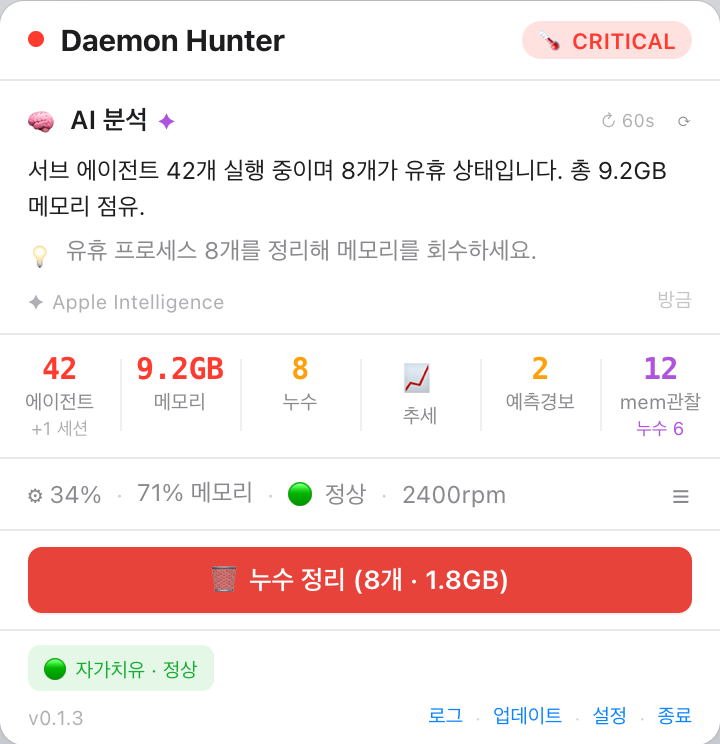
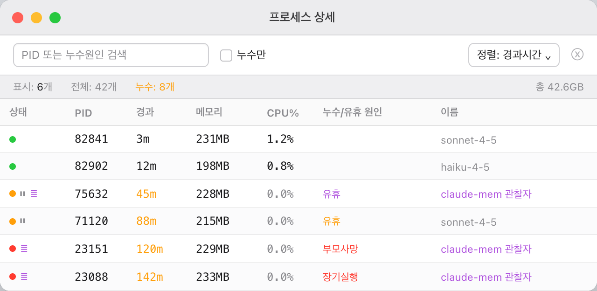

# Daemon Hunter

[English](README.md)

> macOS 시스템 프로세스와 자원 상태를 감시해 문제를 일으키는 앱을 진단하고, 필요하면 직접 조치까지 할 수 있게 해주는 메뉴바 앱


---

## 무엇을 하는 앱인가요?

Daemon Hunter는 메뉴바에 상주하며 특정 도구 하나가 아니라 Mac에서 돌아가는 모든 앱을 상시 감시합니다. 전체 프로세스를 앱 단위로 묶고, 카테고리(AI 에이전트/클라우드 동기화/브라우저/개발 도구/시스템/기타)로 자동 분류하며, 어떤 앱이 메모리와 CPU를 많이 쓰고 있는지 추적합니다.

특정 앱의 메모리가 계속 늘어나거나, 시스템 전체가 압박(메모리 압박·스왑 스래싱·처리 용량을 넘어선 CPU 부하) 상태에 들어가면 이를 표면화합니다. Apple Intelligence가 관측된 사실을 검토해 구체적인 진단과 처방을 작성하고, 실제 근거(부모가 죽은 것이 확인된 고아 프로세스, 압박이 지속되는 누수의심 앱 등)가 있을 때는 대상 앱을 지목해 종료를 제안합니다. 무엇을 종료하든 항상 사용자의 확인을 거칩니다.


메뉴바 아이콘은 신호등입니다. 정상일 때 **초록**, 경고 시 **노랑**(맥동), 위험 시 **빨강**(빠른 맥동, 누수의심 개수 배지 표시).

---

## 스크린샷

*(아래 스크린샷은 이전 버전 기준이며, 현재의 앱 단위 추적 UI에 맞춰 추후 갱신 예정입니다.)*

### 상태 팝오버



### 프로세스 상세 창



---

## 주요 기능

### 전역 앱별 리소스 추적
- 시스템의 전체 프로세스를 앱(번들/실행파일 이름) 단위로 집계
- `ai_agent` / `cloud_sync` / `browser` / `dev_tool` / `system` / `other` 6개 카테고리로 자동 분류
- 특정 도구 전용 필터 없이 모든 앱의 메모리·CPU 상위 소비를 상시 추적
- 연속적인 메모리 증가 패턴으로 **누수의심** 앱을 자동 표시

### 시스템 압박 판정
- CPU 부하/코어 비율, 커널 메모리 압박 레벨, 스왑 IO 처리율(크기가 아니라 스래싱 신호)을 종합해 **정상/경고/위험** 3단계로 판정
- 비대칭 히스테리시스 적용 — 악화는 즉시 반영하되, 완화는 여러 차례 연속으로 정상 신호가 확인된 뒤에만 — 상태가 깜빡이지 않도록

### 온디맨드 상세 평가 (드릴다운)
- 부하가 임계치를 넘은 앱만 개별 PID 단위로 드릴다운 평가
- 부모 프로세스 사망이 확인된 **고아** 프로세스, CPU 활동이 없는 **유휴** 프로세스를 표시
- 필요한 앱에 대해서만 상세 평가를 수행해 평상시 관측 비용을 낮게 유지

### Apple Intelligence 진단·처방
- `FoundationModels`(`@Generable`)를 통한 온디바이스 LLM 분석, AI 미탑재/응답 지연 시 규칙 기반 분석으로 즉시 폴백
- 진단은 관측된 사실(추적 앱 현황·누수의심·시스템 압박)에만 근거 — 수치나 예측을 지어내지 않음
- 기계적 근거(고아 확인, 누수의심 + 압박 지속 등)가 있을 때만 특정 앱의 종료를 제안 — 모호한 "정리를 고려하세요" 식 문구 없음

### 조치 실행
- 추적 중인 모든 앱에 종료 버튼 제공
- AI가 종료를 제안하면 팝오버에 "AI 제안: OO 종료" 버튼 노출
- 두 경로 모두 항상 확인 알림창을 거침 — AI는 제안만 할 뿐 직접 실행하지 않음

### 추세 분석
- 시간 기반 기울기(실제 타임스탬프, 재시작 갭 인지)로 안정/완만증가/급속증가/일시급증/감소 패턴 분류
- 앱/카테고리별 히스토리 스파크라인 제공

### 스마트 알림
- 상태 전환 또는 즉각 조치가 필요한 순간에만 알림 발송, 10분 쿨다운으로 중복 방지
- 확인/누수 정리/열기 등 실행 가능한 버튼 포함

### 자기 부하 자동조절
- 앱 자신의 메모리·CPU 사용량을 직접 측정해 5단계(정상→주의→절감→최소→일시중단) 백프레셔 적용
- 자신의 부하가 커지면 폴링 주기를 늘리고 AI 분석·DB 기록을 줄여, 감시 도구 자체가 시스템 부하의 원인이 되지 않도록 설계

### SQLite 이력 저장 (v5 스키마)
- 리소스 스냅샷, 시스템 압박 이벤트, 앱 건전성 로그, 예측 이력을 SQLite에 기록
- `PRAGMA user_version` 기반 자동 마이그레이션

### 다국어 UI
- 공식 지원 언어는 한국어·영어(시스템 언어를 따라가며, 그 외 언어는 영어로 폴백)
- 일본어·중국어(간체/번체)·스페인어·프랑스어·독일어·포르투갈어·아랍어 번역 데이터는 코드베이스에 보존되어 있으며, 향후 정식 지원을 위한 것

---

## 시스템 요구사항

| 항목 | 요구사항 |
|------|---------|
| **macOS** | 26.0 (Tahoe) 이상 |
| **아키텍처** | Apple Silicon 전용 (M1/M2/M3/M4) |
| **개발 언어** | Swift 6.0 |

> Intel Mac은 지원하지 않습니다 — Intel에서 실행 시 경고 후 종료됩니다.

---

## 설치 방법

### 다운로드 (권장)

1. [Releases](https://github.com/beret21/DaemonHunter/releases)에서 `DaemonHunter-x.y.z.zip` 다운로드
2. 압축 해제 후 `DaemonHunter.app`을 Applications로 이동
3. 최초 설치 이후 업데이트는 Sparkle을 통해 자동 배포

### 소스에서 빌드

```bash
git clone https://github.com/beret21/DaemonHunter.git
cd DaemonHunter
open ClaudeAgentMonitor.xcodeproj
# Product → Archive → Distribute App
```

---

## 아키텍처

```
DaemonHunter/
├── App/
│   ├── ClaudeAgentMonitorApp.swift   # @main, MenuBarExtra, Window scenes
│   └── AppDelegate.swift             # 생명주기 배선: ResourceTracker, SystemHealthEvaluator, PredictionEngine
├── Core/
│   ├── ResourceTracker.swift         # 전역 앱별 추적, 카테고리 분류, 누수의심 탐지, 드릴다운, 종료
│   ├── SystemHealthEvaluator.swift   # 시스템 전체 압박 판정(load/메모리/스왑), 히스테리시스
│   ├── GlobalProcessScanner.swift    # SystemHealthEvaluator에 데이터를 공급하는 전체 PID 스캔
│   ├── SelfHealingManager.swift      # 자기 부하 백프레셔 (5단계)
│   ├── ProcessHistoryTracker.swift   # 스냅샷 기록, 추세 분석
│   ├── PredictionEngine.swift / KalmanFilter.swift  # 칼만 필터 기반 추세·이상 신호
│   ├── DatabaseManager.swift         # SQLite3 + 마이그레이션 (v5)
│   ├── SystemMetrics.swift           # CPU%, load average, 발열, 팬
│   └── LocalizationManager.swift     # 다국어 문자열 테이블 (KO/EN 공식, 8개 언어 보존)
├── Intelligence/
│   ├── ProcessAnalyzer.swift         # Apple Intelligence + 규칙 기반 폴백, 종료 제안
│   └── NotificationCoordinator.swift # UNUserNotificationCenter, 쿨다운
└── UI/
    ├── StatusPopoverView.swift        # 메인 팝오버
    ├── ProcessDetailView.swift        # 앱 단위 테이블, 행별 종료 버튼 + 드릴다운
    ├── SettingsView.swift             # 설정 패널
    ├── TrendChartView.swift / TrendSummaryView.swift  # 스파크라인 + 추세 요약
    └── CleanupLogView.swift           # 프로세스 이벤트 이력 로그
```

> 참고: 기존 Claude Code 서브에이전트 전용 스캐너였던 `ProcessMonitor.swift` / `AgentProcess.swift`는 아직 코드베이스에 남아 있으며, 위 범용 파이프라인으로 대체되며 단계적으로 정리되는 중입니다.

---

## 변경 이력

### 0.2.0 — 2026-07-12

- **전환**: "Claude Code 서브에이전트 전용 감시"에서 "범용 시스템 프로세스/자원 건전성 관리 도구"로 전환
- **신규**: `ResourceTracker`의 전역 앱별 추적(카테고리 분류, 누수의심 탐지)을 주 파이프라인으로 승격
- **신규**: `SystemHealthEvaluator`의 압박 기반(load/메모리압박/스왑IO) 시스템 건전성 판정
- **신규**: 부하 임계 초과 앱에 대한 온디맨드 상세평가(고아/유휴 드릴다운)
- **신규**: Apple Intelligence 진단에 근거 기반 종료 제안 필드 추가, 앱별/AI 제안 종료 버튼(항상 확인 필요)
- **정리**: 앱 소개·기능 설명에서 Claude 전용 서사 제거, 범용 시스템 모니터 기준으로 재작성

### v0.1.3 — 2026-06-22

- **추가**: 앱 이름 "AI Agent Monitor" → **Daemon Hunter** 변경
- **추가**: `--disallowedTools` 플래그로 `claude-mem` 관찰자 프로세스 감지
- **추가**: 프로세스 상세 창에 "이름" 컬럼 추가 (`cmdArgs`)
- **추가**: claude-mem 관찰자 프로세스용 보라색 상태 표시
- **추가**: 신호등 메뉴바 아이콘 (초록/노랑/빨강) + 맥동 애니메이션
- **추가**: `buildnumber.txt` 기반 빌드 번호 자동 증가 (Xcode 빌드 페이즈)
- **추가**: 가독성 향상을 위한 흰색 배경 팝오버
- **추가**: 상태 팝오버에 `mem관찰` 통계 셀 추가
- **수정**: 관찰자 누수 임계값 30분으로 설정 (일반 서브에이전트 90분 대비)

### v0.1.0 — 2026-06-19

- 최초 출시
- Claude Code 서브에이전트 프로세스 실시간 모니터링
- 유휴 감지 (CPU 델타 < 10ms × 3회 연속 스냅샷)
- 칼만 필터 예측 + 잔차 z-score 이상 탐지
- 절대값 이상 경보 (프로세스 수, 메모리, CPU, 발열)
- Apple Intelligence 디바이스 내 분석 + 규칙 기반 폴백
- 앱 부하 자동조절 5단계 백프레셔
- 스마트 알림 (10분 쿨다운)
- SQLite v5 스키마 + 자동 마이그레이션
- 10개 언어 UI

---

## 기여

이슈와 PR 환영합니다. 대규모 변경 전에 이슈를 먼저 열어 주세요.

---

## 라이선스

MIT License — [LICENSE](LICENSE) 참조
