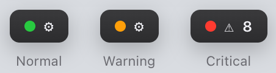
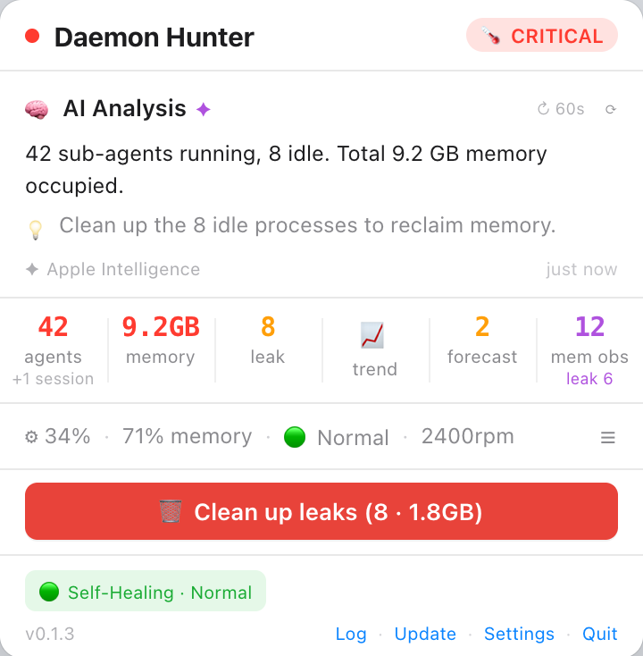
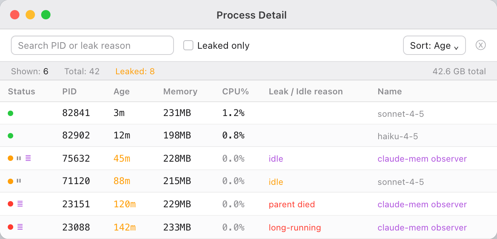

# Daemon Hunter

[한국어](README.ko.md)

> A macOS menu bar app that watches system processes and resource health, diagnoses the apps causing trouble, and lets you act on it.


---

## What It Does

Daemon Hunter sits in your menu bar and continuously watches every app running on your Mac — not just one specific tool. It groups all processes by app, classifies them into categories (AI agent, cloud sync, browser, dev tool, system, other), and tracks who's consuming memory and CPU.

When memory keeps growing in one app, or the whole system is under pressure (memory pressure, swap thrashing, CPU load over capacity), Daemon Hunter surfaces it. Apple Intelligence reviews the observed facts and writes a concrete diagnosis and prescription — and when there's actual evidence (a confirmed orphaned process, a leak suspect under sustained pressure), it names the app and suggests terminating it. You always confirm before anything is closed.



The menu bar icon is a traffic light: **green** when normal, **yellow** (pulsing) on warning, and **red** (fast pulse, with a leak-suspect count badge) when critical.

---

## Screenshots

*(Screenshots below are from an earlier version and will be refreshed to reflect the current app-tracking UI.)*

### Status Popover



### Process Detail Window



---

## Features

### Global Resource Tracking
- Aggregates every process on the system by app (bundle/executable name)
- Auto-classifies each app into a category: `ai_agent` / `cloud_sync` / `browser` / `dev_tool` / `system` / `other`
- Tracks top memory and CPU consumers continuously, no per-tool filtering
- Flags **leak-suspect** apps from a sustained memory-growth pattern (consecutive increases)

### System Pressure Evaluation
- Judges overall system health as **Normal / Warning / Critical** from CPU load vs. core count, kernel memory-pressure level, and swap I/O rate (thrashing signal, not just swap size)
- Asymmetric hysteresis: escalates instantly, but only de-escalates after several consecutive clean readings — so the status doesn't flicker

### On-Demand Detailed Evaluation
- Apps that cross a load threshold get a per-PID drill-down: **orphan** processes (parent confirmed dead) and **idle** processes (no CPU activity)
- Drill-down only runs for apps that need it, keeping routine observation cheap

### Apple Intelligence Diagnosis & Prescription
- On-device LLM analysis via `FoundationModels` (`@Generable`), with an immediate rule-based fallback when AI is unavailable or slow
- Diagnosis is grounded only in observed facts (tracked apps, leak suspects, system pressure) — no fabricated numbers or predictions
- Suggests terminating a specific app only when there's mechanical evidence (confirmed orphan, leak suspect under sustained pressure, etc.) — never a vague "consider cleaning up"

### Take Action
- Every tracked app has a Terminate button
- When the AI suggests a kill, the popover shows an "AI suggestion: quit *App*" button
- Both paths always go through a confirmation alert — the AI can suggest, but never executes on its own

### Trend Analysis
- Time-based slope (real timestamps, gap-aware after restarts) classifies trends as stable / slow-growing / fast-growing / spike / shrinking
- Historical sparkline per app/category

### Smart Notifications
- Notifications fire only on state transitions or when action is warranted, with a 10-minute cooldown to avoid duplicates
- Actionable buttons (Confirm / Clean Up / Open)

### Self-Load Throttling
- Measures its own memory/CPU usage and applies 5-level backpressure: Normal → Cautious → Reduced → Minimal → Suspended
- Backs off polling frequency and AI/DB work under its own load, so the watchdog doesn't become part of the problem

### SQLite History (v5 schema)
- Resource snapshots, system-pressure events, app health log, and prediction history are recorded to SQLite
- Automatic migration via `PRAGMA user_version`

### Multilingual UI
- Officially supported: Korean and English (follows system language; anything else falls back to English)
- Japanese, Simplified/Traditional Chinese, Spanish, French, German, Portuguese, and Arabic translation data exists in the codebase, reserved for future official support

---

## Requirements

| Item | Requirement |
|------|------------|
| **macOS** | 26.0 (Tahoe) or later |
| **Architecture** | Apple Silicon (M1/M2/M3/M4) only |
| **Swift** | 6.0 |

> Intel Mac is not supported — the app exits with an alert if running on Intel.

---

## Installation

### Download (Recommended)

1. Download `DaemonHunter-x.y.z.zip` from [Releases](https://github.com/beret21/DaemonHunter/releases)
2. Unzip and move `DaemonHunter.app` to Applications
3. After initial install, updates are delivered automatically via Sparkle

### Build from Source

```bash
git clone https://github.com/beret21/DaemonHunter.git
cd DaemonHunter
open ClaudeAgentMonitor.xcodeproj
# Product → Archive → Distribute App
```

---

## Architecture

```
DaemonHunter/
├── App/
│   ├── ClaudeAgentMonitorApp.swift   # @main, MenuBarExtra, Window scenes
│   └── AppDelegate.swift             # Lifecycle wiring: ResourceTracker, SystemHealthEvaluator, PredictionEngine
├── Core/
│   ├── ResourceTracker.swift         # Global per-app tracking, categorization, leak-suspect detection, drill-down, kill
│   ├── SystemHealthEvaluator.swift   # System-wide pressure judgment (load/memory/swap), hysteresis
│   ├── GlobalProcessScanner.swift    # All-PID scan feeding SystemHealthEvaluator
│   ├── SelfHealingManager.swift      # Self-load backpressure (5 levels)
│   ├── ProcessHistoryTracker.swift   # Snapshot recording, trend analysis
│   ├── PredictionEngine.swift / KalmanFilter.swift  # Kalman-filtered trend/anomaly signals
│   ├── DatabaseManager.swift         # SQLite3 + migration (v5)
│   ├── SystemMetrics.swift           # CPU%, load avg, thermal, fan
│   └── LocalizationManager.swift     # String table (KO/EN official, 8 more reserved)
├── Intelligence/
│   ├── ProcessAnalyzer.swift         # Apple Intelligence + rule-based fallback, kill suggestion
│   └── NotificationCoordinator.swift # UNUserNotificationCenter, cooldown
└── UI/
    ├── StatusPopoverView.swift        # Main popover
    ├── ProcessDetailView.swift        # App-level table, per-row terminate + drill-down
    ├── SettingsView.swift             # Settings panel
    ├── TrendChartView.swift / TrendSummaryView.swift  # Sparkline + trend summary
    └── CleanupLogView.swift           # Process event history log
```

> Note: `ProcessMonitor.swift` / `AgentProcess.swift` (the original Claude Code sub-agent–only scanner) are still present in the codebase and are being phased out as the general-purpose pipeline above takes over.

---

## Changelog

### 0.2.0 — 2026-07-12

- **Transition**: Moved from "Claude Code sub-agent–only monitoring" to a general-purpose system process/resource health tool
- **New**: `ResourceTracker`'s global per-app tracking (category classification, leak-suspect detection) promoted to the primary pipeline
- **New**: `SystemHealthEvaluator`'s pressure-based (load/memory pressure/swap I/O) system health judgment
- **New**: On-demand detailed evaluation (orphan/idle drill-down) for apps that cross a load threshold
- **New**: Apple Intelligence diagnosis gained evidence-based kill suggestion fields; per-app and AI-suggested terminate buttons (confirmation always required)
- **Cleanup**: Removed the Claude-only framing from the app description and features; rewritten around the general-purpose monitor

### v0.1.3 — 2026-06-22

- **New**: Renamed app from "AI Agent Monitor" to **Daemon Hunter**
- **New**: `claude-mem` observer detection via `--disallowedTools` flag
- **New**: "Name" column in Process Detail view (`cmdArgs`)
- **New**: Purple status indicator for claude-mem observer processes
- **New**: Traffic-light menu bar icon (green / yellow / red) with pulsing animation
- **New**: Build number auto-increment via `buildnumber.txt` (Xcode build phase)
- **New**: White background popover for better readability
- **New**: `mem관찰` stats cell in status popover
- **Fix**: Observer leak threshold set to 30 min (vs 90 min for regular sub-agents)

### v0.1.0 — 2026-06-19

- Initial release
- Real-time Claude Code sub-agent process monitoring
- Idle detection (CPU delta < 10 ms × 3 consecutive snapshots)
- Kalman filter prediction with residual z-score anomaly detection
- Absolute value anomaly alerting (process count, memory, CPU, thermal)
- Apple Intelligence on-device analysis with rule-based fallback
- Adaptive load throttling: 5-level backpressure
- Smart notifications with 10-minute cooldown
- SQLite v5 schema with automatic migration
- 10-language UI

---

## Contributing

Issues and PRs welcome. Please open an issue before starting large changes.

---

## License

MIT License — see [LICENSE](LICENSE) for details.
